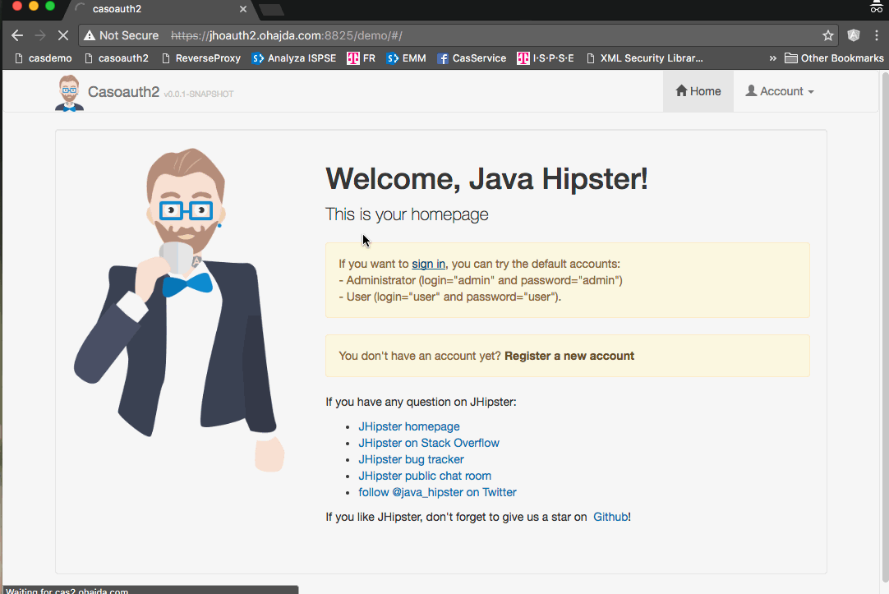
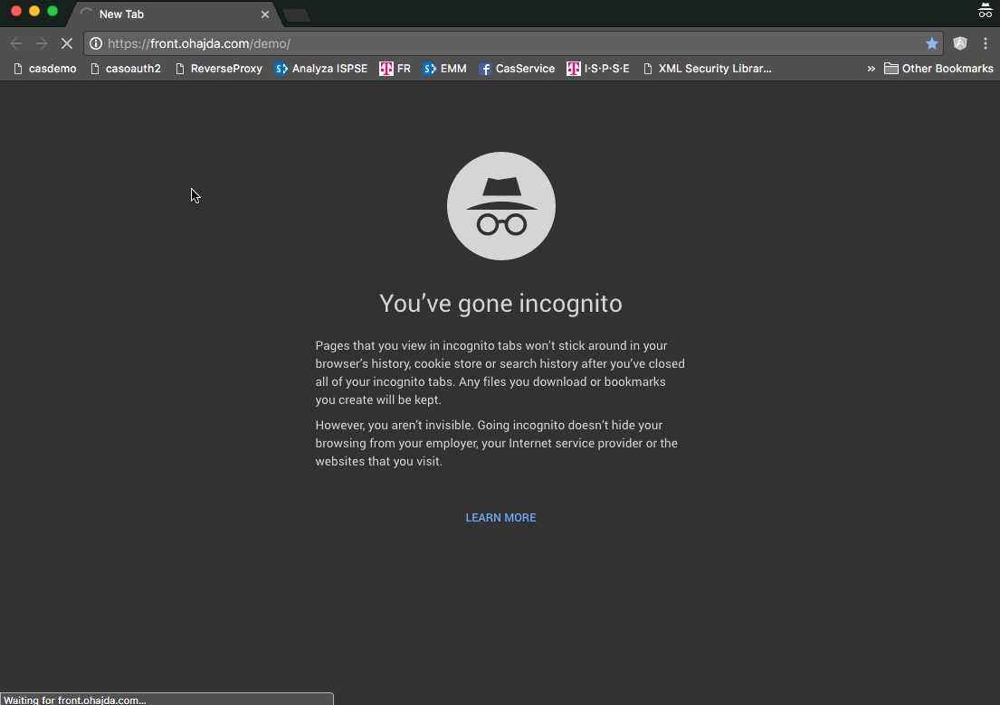

# CAS Oauth2 and JHipster app

I am testing CAS Oauth2 with JHipster so I have created this repository to keep track what I have done.

## Building steps

Here is summary of steps

1. Create JHipster application
    - Add entity CITY and configure sample data
    - Start docker container as postgres development database
    - Run initial application with development profile
2. CASifying application
    - Enable SSL for JHipster application
    - Configure CAS OAuth2 docker container
    - Adjust JHipster to use CAS for authentication
3. Frontend proxy
    - Configure reverse proxy
    - Add security via mod_auth_cas

### 1. Create JHipster application

    mkdir casoauth2
    cd casoauth2
    yo jhipster

- Monolithic application
- Type of authentication - select **OAuth2 Authentication**
- PostgreSQL as production and development database
- Maven

#### Add entity CITY and configure sample data

    yo jhipster:entity city

2 attributes:

- name
- country

Modify liquibase script to prepare initial sample data. Create file `src/main/resources/config/liquibase/cities.csv` with
sample data. Create new changeset in `src/main/resources/config/liquibase/changelog/*added_entity_City.xml` to load data.

#### Start docker container as postgres development database

As I ma using few docker postgres containers I am running this one with port 5232

    docker run --name pgdev2 -p 5232:5432 -e POSTGRES_USER=casoauth2 -d postgres:9.5.4

in order to work with application there is need to change `src/main/resources/config/application-dev.yml`

from:

    datasource:
        type: com.zaxxer.hikari.HikariDataSource
        url: jdbc:postgresql://localhost:5432/casoauth2
        name:
        username: casoauth2
        password:

to:

    datasource:
        type: com.zaxxer.hikari.HikariDataSource
        url: jdbc:postgresql://localhost:5232/casoauth2
        name:
        username: casoauth2
        password: casoauth2

### 2. CASifying application

Here we modify application from step 1. to use CAS as OAuth2 SSO. This part I have done based on various examples from
Github and Spring. For development purpose we will use docker container for CAS server and modify JHipster to use it.

#### Enable SSL for JHipster application

    keytool -genkey -noprompt\
     -alias jhoauth2\
     -keyalg RSA\
     -validity 999\
     -dname "CN=jhoauth2.ohajda.com, OU=Test, O=Test, L=Test, S=Test, C=SK"\
     -keystore src/main/docker/keystore\
     -storepass changeit\
     -keypass changeit

- change port in config file. I will set it to 8825. In addition I will set context path to **demo** for JHipster
  application.

Modify server section in `src/main/resources/config/application-dev.yml`

From:

    server:
        port: 8080

To:

    server:
        contextPath: /demo
        port: 8825
        ssl:
            key-store: src/main/docker/keystore
            key-password: changeit
            key-store-password: changeit
            enabled: true

#### Configure CAS OAuth2 docker container

For demo purpose CAS server will be modified to use JHipster database as user repository so we can keep using JHipster for
user management and CAS for authentication. As I want to use database authentication I need to change `pom.xml` in overlay
project and build it. As it take time I am creating `src/main/docker-cas` where I will prebuild image for this demo.

Build docker image locally for cas (as of 5.0.1 there is still bug using BCrypt and database authentication so fix is done
localy)

    cd src/main/docker-cas
    docker build -t rohajda/cas-oauth2:v5.0.1 .
    cd ../../..

Create thekeystore for CAS

    keytool -genkey -noprompt\
        -alias cas\
        -keyalg RSA\
        -validity 999\
        -dname "CN=cas2.ohajda.com, OU=Test, O=Test, L=Test, S=Test, C=SK"\
        -keystore src/main/docker/thekeystore \
        -storepass changeit\
        -keypass changeit

Register certificate as trusted in java

    keytool -export -alias cas -storepass changeit -file src/main/docker/cas2.cer -keystore  src/main/docker/thekeystore
    sudo keytool -import -alias cas2 -keystore $JAVA_HOME/jre/lib/security/cacerts -file src/main/docker/cas2.cer

Add alias for localhost to hosts file

- cas2.ohajda.com
- jhoauth2.ohajda.com

Run development CAS server

    docker run --name cas2 -p 8843:8843 --link pgdev2:pgdev2\
     -h cas2.ohajda.com\
     -v $(pwd)/src/main/docker/thekeystore:/etc/cas/thekeystore \
     -v $(pwd)/src/main/docker/dev/cas/config/cas.properties:/cas-overlay/etc/cas/config/cas.properties\
     -v $(pwd)/src/main/docker/dev/cas/config/log4j2.xml:/cas-overlay/etc/cas/config/log4j2.xml\
     -v $(pwd)/src/main/docker/dev/cas/services:/etc/cas/services\
     rohajda/cas-oauth2:v5.0.1

Adjust JHipster to use CAS OAuth2 for authentication

    cas:
        client:
            clientId: clientid
            clientSecret: clientSecret
            accessTokenUri: https://cas2.ohajda.com:8843/cas/oauth2.0/accessToken
            userAuthorizationUri: https://cas2.ohajda.com:8843/cas/oauth2.0/authorize
            tokenName: access_token
            authenticationScheme: query
            clientAuthenticationScheme: form
        resource:
            userInfoUri: https://cas2.ohajda.com:8843/cas/oauth2.0/profile
        url:
            logout: https://cas2.ohajda.com:8843/cas/logout
            service: https://jhoauth2.ohajda.com:8825/demo/

Remove unused classess

- AjaxLogoutSuccessHandler
- OAuth2ServerConfiguration

Remove from liquibase initial change log oauth2 related objects

Modify classes and java script files

- SecurityConfiguration.java
- UserService.java
- auth.service.js

Add new logout controller (workaround as I did not manage to go around CORS related issues with redirect to CAS)

- LogoutResource.java

#### Run initial application with development profile

Use **IntelliJ** run option or use command line from terminal `./mvnw`

    https://jhoauth2.ohajda.com:8825/demo/

Run production setup

- build first (i am skipping test as i did not have time to fix karma test)

                mvn clean

        ./mvnw package -Pprod -DskipTests docker:build

- start docker compose

    docker-compose -f src/main/docker/app.yml up

- connect to application as **admin/admin**

    https://jhoauth2.ohajda.com:8825/demo/

### 3. Frontend proxy

In production like environmnet DMZ will have reverse proxy server routing request to internal network where is CAS and
JHipster application. In addition as per some customer they requesting extra security that will ensure that all requests
reaching internal JHipster application are authenticated and if needed extra 2fa authentication can be configured. To
simulate my customer requirement OS used will be Centos 7.

#### Configure reverse proxy

In this step we will build docker image with httpd 2.4 , mod ssl and proxy. In addition I have build rpm for mod_auth_cas
using git project https://github.com/rohajda/mod_auth_cas (i have fixed some small issue of original project so it
generates artifact as I needed). As httpd will redirect to cas2 server i need cas2 certificate to be registered to trusted
one.

Build image with httpd and other parts needed for docker-compose

    cd src/main/docker-httpd
    docker build -t rohajda/casoauth2-httpd:v1.0 .
    cd ../../..

Register new alias `front.ohajda.com` for localhost in `/etc/hosts`

Generate server certificate for SSL mode

    keytool -genkey -noprompt -alias fr -keyalg RSA -validity 999 -dname "CN=front.ohajda.com, OU=Test, O=Test, L=Test, S=Test, C=SK" -keystore src/main/docker/httpd/frkeystore -storepass changeit -keypass changeit;

    openssl req -new -x509 -nodes -subj "/C=SK/ST=Test/L=Test/O=Dis/CN=front.ohajda.com" -out src/main/docker/httpd/front.ohajda.com.crt -keyout src/main/docker/httpd/front.ohajda.com.key

Configure simple reverse proxy by adding below text to `ssl.conf` file at the end of file before `</VirtualHost>` Setup is
for demo only so real securing should be done on reverese proxy and it is outside of this demo scope.

    ##################################
    #  FRONT SETUP
    ##################################

    SSLCertificateFile /etc/pki/tls/certs/front.ohajda.com.crt
    SSLCertificateKeyFile /etc/pki/tls/private/front.ohajda.com.key

    ServerAdmin webmaster@localhost
    ProxyPreserveHost On
    SSLProxyEngine on
    SSLProxyVerify none
    SSLProxyCheckPeerCN off
    SSLProxyCheckPeerName off
    SSLProxyCheckPeerExpire off

    ServerName front.ohajda.com:443

    ProxyRequests off
    ProxyPass "/demo/" "https://jhoauth2.ohajda.com:8825/demo/"
    ProxyPassReverse "/demo/" "https://jhoauth2.ohajda.com:8825/demo/"
    ProxyPass "/cas/" "https://cas2.ohajda.com:8843/cas/"
    ProxyPassReverse "/cas/" "https://cas2.ohajda.com:8843/cas/"

Start docker compose and test direct access as well as access via reverse proxy

    docker-compose -f src/main/docker/app.yml up

- Direct access URL is https://jhoauth2.ohajda.com:8825/demo/
- Reverse proxy URL is https://front.ohajda.com/demo/

Add extra authentication on reverse proxy using mod_cas_auth module

- configure `auth_cas.conf` on httpd server

auth_cas.conf file

    <IfModule !mod_ssl.c>
        LoadModule ssl_module modules/mod_ssl.so
    </IfModule>

    LoadModule auth_cas_module modules/mod_auth_cas.so

    CASCookiePath /var/cache/httpd/cas/

    CASLoginURL https://front.ohajda.com/cas/login

    CASValidateURL https://front.ohajda.com/cas/serviceValidate

    CASRootProxiedAs https://front.ohajda.com

    CASCertificatePath /etc/ssl/certs/front.ohajda.com.crt

- setup authentication for `/demo/` location in `ssl.conf`

ssl.conf file (add lines after `ProxyPassReverse "/cas/" "https://cas2.ohajda.com:8843/cas/"`

    <Location "/demo/">
       Authtype CAS
       AuthName 'CAS'
       Require valid-user
    </Location>

- Add new service in CAS configuration for reverse proxy `FRONT-102.json`
- start environment via `docker-compose -f src/main/docker/app.yml up`

We are ready to test direct access and reverese proxy

- Direct access URL is https://jhoauth2.ohajda.com:8825/demo/

- Reverse proxy URL is https://front.ohajda.com/demo/

>Important to add is that user need to provide username/password only once at reverese proxy. Rest is taken care by SSO CAS
>feauture. Having 2 services on CAS enabling easily control who can access from outside as well allowing to add additional
>authentication factors that are not required if user is in internal network without changing JHipster application.

## JHipster setup

This application was generated using JHipster 3.12.2, you can find documentation and help at
[https://jhipster.github.io/documentation-archive/v3.12.2](https://jhipster.github.io/documentation-archive/v3.12.2).

## Development

Before you can build this project, you must install and configure the following dependencies on your machine: 1.
[Node.js][]: We use Node to run a development web server and build the project. Depending on your system, you can install
Node either from source or as a pre-packaged bundle.

After installing Node, you should be able to run the following command to install development tools (like [Bower][] and
[BrowserSync][]). You will only need to run this command when dependencies change in package.json.

    npm install

We use [Gulp][] as our build system. Install the Gulp command-line tool globally with:

    npm install -g gulp-cli

Run the following commands in two separate terminals to create a blissful development experience where your browser
auto-refreshes when files change on your hard drive.

    ./mvnw
    gulp

Bower is used to manage CSS and JavaScript dependencies used in this application. You can upgrade dependencies by
specifying a newer version in `bower.json`. You can also run `bower update` and `bower install` to manage dependencies.
Add the `-h` flag on any command to see how you can use it. For example, `bower update -h`.

For further instructions on how to develop with JHipster, have a look at [Using JHipster in development][].

## Building for production

To optimize the casoauth2 application for production, run:

    ./mvnw -Pprod clean package

This will concatenate and minify the client CSS and JavaScript files. It will also modify `index.html` so it references
these new files. To ensure everything worked, run:

    java -jar target/*.war

Then navigate to [http://localhost:8080](http://localhost:8080) in your browser.

Refer to [Using JHipster in production][] for more details.

## Testing

To launch your application's tests, run:

    ./mvnw clean test

### Client tests

Unit tests are run by [Karma][] and written with [Jasmine][]. They're located in `src/test/javascript/` and can be run
with:

    gulp test

For more information, refer to the [Running tests page][].

## Using Docker to simplify development (optional)

You can use Docker to improve your JHipster development experience. A number of docker-compose configuration are available
in the `src/main/docker` folder to launch required third party services. For example, to start a postgresql database in a
docker container, run:

    docker-compose -f src/main/docker/postgresql.yml up -d

To stop it and remove the container, run:

    docker-compose -f src/main/docker/postgresql.yml down

You can also fully dockerize your application and all the services that it depends on. To achieve this, first build a
docker image of your app by running:

    ./mvnw package -Pprod docker:build

Then run:

    docker-compose -f src/main/docker/app.yml up -d

For more information refer to [Using Docker and Docker-Compose][], this page also contains information on the
docker-compose sub-generator (`yo jhipster:docker-compose`), which is able to generate docker configurations for one or
several JHipster applications.

## Continuous Integration (optional)

To set up a CI environment, consult the [Setting up Continuous Integration][] page.

[JHipster Homepage and latest documentation]: https://jhipster.github.io
[JHipster 3.12.2 archive]: https://jhipster.github.io/documentation-archive/v3.12.2

[Using JHipster in development]: https://jhipster.github.io/documentation-archive/v3.12.2/development/
[Using Docker and Docker-Compose]: https://jhipster.github.io/documentation-archive/v3.12.2/docker-compose
[Using JHipster in production]: https://jhipster.github.io/documentation-archive/v3.12.2/production/
[Running tests page]: https://jhipster.github.io/documentation-archive/v3.12.2/running-tests/
[Setting up Continuous Integration]: https://jhipster.github.io/documentation-archive/v3.12.2/setting-up-ci/

[Node.js]: https://nodejs.org/
[Bower]: http://bower.io/
[Gulp]: http://gulpjs.com/
[BrowserSync]: http://www.browsersync.io/
[Karma]: http://karma-runner.github.io/
[Jasmine]: http://jasmine.github.io/2.0/introduction.html
[Protractor]: https://angular.github.io/protractor/
